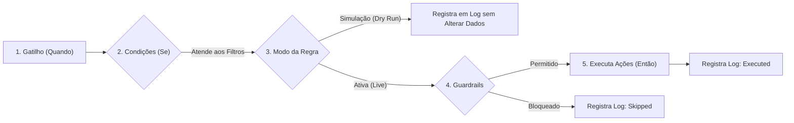

# ⚡ Guia Definitivo de Automações: Casos de Uso & Referência Operacional

> **Módulo:** `chatwoot-kanban`  
> **Autor & Engenharia:** Gihovani Demetrio (GG2) — [gihovani@gg2.com.br](mailto:gihovani@gg2.com.br)  
> **Compatibilidade:** Chatwoot v4.18.x (CE & Forks)

---

## 📖 Visão Geral

O motor de **Automações de Funil** do `chatwoot-kanban` adiciona inteligência orientada a eventos e baseada em tempo diretamente aos seus fluxos comerciais no Chatwoot. 

Ele elimina trabalho manual repetitivo, garante que nenhum lead fique estagnado e assegura que as oportunidades avancem pelo funil de vendas com **SLA**, **atribuição inteligente** e **respostas automáticas**.



---

## 🛡️ Conceitos-Chave da Arquitetura

### A. Modo de Simulação (Dry Run) — Segurança Primeiro
Toda regra criada nasce obrigatoriamente no modo **Simulação (`dry_run: true`)**.
* **Como funciona:** O motor de automação avalia as condições e calcula exatamente o que faria (quais ações dispararia), registrando tudo no **Histórico de Logs**, mas **reverte a transação no banco de dados** (não move cartões, não envia mensagens para o cliente).
* **Para que serve:** Permite que você valide se a regra não terá comportamentos inesperados em massa.
* **Ativação Real:** O botão **"Ativar de verdade"** é habilitado após a regra registrar sua primeira execução simulada no histórico.

### B. Guardrails de Proteção Operacional
Para envio de mensagens automáticas via WhatsApp ou Chat (`send_message`):
* O sistema respeita limites diários de mensagens automáticas por contato para evitar bloqueios ou banimentos de números.
* O sistema bloqueia envios fora da janela permitida ou se o contato estiver marcado como opt-out.
* Se bloqueada pelos guardrails, a ação é registrada nos logs com status `skipped` e motivo detalhado.

### C. Variáveis Dinâmicas Disponíveis (Template Liquid)
Em notas internas (`create_note`, `send_private_note`) e mensagens para o cliente (`send_message`), você pode interpolar variáveis do cartão e do contato:

| Variável | Descrição | Exemplo Renderizado |
|---|---|---|
| `{{ contact_name }}` | Nome do contato / cliente | *Carlos Silva* |
| `{{ agent_name }}` | Nome do atendente responsável | *Ana Beatriz* |
| `{{ card_subject }}` | Título do cartão de oportunidade | *Orçamento de Energia Solar* |
| `{{ total }}` | Valor monetário formatado da oportunidade | *R$ 4.500,00* |
| `{{ card.stage.name }}` | Nome da etapa atual do funil | *Proposta Enviada* |

---

## 🎯 Catálogo de Casos de Uso Práticos (Life Scenarios)

Abaixo estão **9 Casos de Uso reais**, cobrindo cada um dos gatilhos do sistema com passo a passo de configuração na interface e payload JSON.

---

### 📌 Caso de Uso #1: Boas-Vindas, Atribuição e Prazo Inicial de Contato
* **Problema:** Novos leads chegam, mas demoram horas para ter um atendente atribuído e o primeiro contato atrasa.
* **Gatilho (`event_name`):** `card_created` (Oportunidade Criada)
* **Condições (`conditions`):** 
  * `stage_id` = `1` (*Lead / Primeiro Contato*)
* **Ações Automáticas (`actions`):**
  1. `assign_agents`: Distribuir entre os atendentes via modo **Round-Robin** (`mode: 'round_robin'`).
  2. `set_priority`: Definir prioridade como `medium`.
  3. `set_due_at`: Definir prazo de vencimento para **1 dia útil** (`days: 1`, `business_days: true`).
  4. `create_note`: Criar nota interna: *"Lead recebido via integração. SLA de primeiro contato: 24h úteis."*
* **Configuração no Painel:**
  1. Acesse o Funil ➔ **Configurações** ➔ Aba **Automações** ➔ **Adicionar regra**.
  2. **Quando:** Selecione *"Cartão criado"*.
  3. **Se:** Adicione a condição `Estágio` `igual a` `Lead / Primeiro Contato`.
  4. **Então:** Adicione as ações de atribuição, prioridade e vencimento.
* **Payload JSON:**
```json
{
  "name": "SLA e Atribuição de Novos Leads",
  "event_name": "card_created",
  "conditions": [
    { "attribute_key": "stage_id", "filter_operator": "equal_to", "values": [1] }
  ],
  "actions": [
    { "action_name": "assign_agents", "action_params": { "mode": "round_robin", "agent_ids": [1, 2] } },
    { "action_name": "set_priority", "action_params": { "priority": "medium" } },
    { "action_name": "set_due_at", "action_params": { "days": 1, "business_days": true } },
    { "action_name": "create_note", "action_params": { "content": "Lead recebido via integração. SLA de primeiro contato: 24h úteis." } }
  ]
}
```

---

### 📌 Caso de Uso #2: Elevação para Prioridade Urgente em Propostas de Alto Valor
* **Problema:** Vendedores tratam propostas de R$ 500 com a mesma prioridade de propostas de R$ 50.000.
* **Gatilho (`event_name`):** `stage_changed` (Mudança de Estágio)
* **Condições (`conditions`):**
  * `stage_id` = `2` (*Em Negociação / Proposta*)
  * `total_value` `greater_than` `10000` (Valor total maior que R$ 10.000)
* **Ações Automáticas (`actions`):**
  1. `set_priority`: Alterar prioridade para `urgent`.
  2. `add_label`: Adicionar etiquetas `["deal-vip", "alto-valor"]`.
  3. `send_private_note`: Enviar nota privada na conversa: *"⚠️ Oportunidade VIP de R$ {{ total }} em negociação! Priorize o atendimento."*
* **Resultado:** O card ganha destaque visual imediato no Kanban com badge vermelho de urgência e etiquetas.

---

### 📌 Caso de Uso #3: Fechamento Ganho ➔ Criação Automática no Funil de Pós-Venda
* **Problema:** Quando a venda é ganha, o time de implantação/onboarding não fica sabendo e o cliente espera dias para iniciar o onboarding.
* **Gatilho (`event_name`):** `card_won` (Venda Ganha)
* **Condições (`conditions`):** Nenhuma (aplica a todos os cartões que atingirem a etapa Ganho).
* **Ações Automáticas (`actions`):**
  1. `create_card_in_board`: Criar cartão automaticamente no funil **"Orçamentos e Projetos / Onboarding"** (`kanban_board_id: 2`, `stage_id: 5`).
  2. `create_note`: Gravar histórico: *"Venda concluída por {{ agent_name }}. Cartão derivado enviado para o time de Projetos."*
  3. `send_message`: Enviar mensagem para o cliente: *"Parabéns, {{ contact_name }}! Seu pedido foi confirmado com sucesso. Nossa equipe de implantação entrará em contato em breve."*
* **Resultado:** A oportunidade concluída gera instantaneamente a demanda na esteira do time técnico.

---

### 📌 Caso de Uso #4: Desqualificação de Lead com Motivo e Limpeza de Tags
* **Problema:** Leads perdidos continuam com tags ativas como "proposta-enviada", poluindo relatórios e filtros.
* **Gatilho (`event_name`):** `card_lost` (Venda Perdida)
* **Condições (`conditions`):** Nenhuma.
* **Ações Automáticas (`actions`):**
  1. `remove_label`: Remover etiquetas `["proposta-enviada", "negociacao-ativa"]`.
  2. `add_label`: Adicionar etiqueta `["lead-perdido"]`.
  3. `create_note`: *"Oportunidade encerrada como Perdida. Motivo auditado no sistema."*
* **Resultado:** Base de dados sanitizada sem retrabalho do vendedor.

---

### 📌 Caso de Uso #5: Resgate de Oportunidade Reaberta
* **Problema:** Um cliente que havia desistido volta a responder semanas depois, mas o cartão permanece esquecido na etapa de perda.
* **Gatilho (`event_name`):** `card_reopened` (Cartão Reaberto)
* **Condições (`conditions`):**
  * `previous_stage_id` = `10` (*Perdido*)
* **Ações Automáticas (`actions`):**
  1. `set_priority`: Definir prioridade para `high`.
  2. `add_label`: Adicionar etiqueta `["reengajamento", "resgate"]`.
  3. `create_note`: *"Cliente reengajou após período inativo! Oportunidade reaberta automaticamente."*
* **Resultado:** O vendedor é alertado imediatamente sobre a oportunidade de renegociação.

---

### 📌 Caso de Uso #6: Alerta de Lead Estagnado há mais de 48 Horas
* **Problema:** Oportunidades ficam dias esquecidas em etapas intermediárias sem nenhuma evolução.
* **Gatilho (`event_name`):** `card_stalled` (Cartão Estagnado por Tempo)
* **Parâmetro de Tempo (`threshold_hours`):** `48` (48 horas no mesmo estágio)
* **Condições (`conditions`):**
  * `stage_id` = `1` (*Lead / Primeiro Contato*)
* **Ações Automáticas (`actions`):**
  1. `set_priority`: Elevar prioridade para `urgent`.
  2. `add_label`: Adicionar etiqueta `["estagnado-48h"]`.
  3. `create_note`: *"🚨 ATENÇÃO: Lead sem movimentação há 48 horas nesta etapa! Faça o follow-up."*
* **Como o sistema avalia:** O job em background `KanbanAutomations::ScanTimeBasedJob` executa a cada hora inspecionando o campo `stage_entered_at` dos cartões.

---

### 📌 Caso de Uso #7: Aviso Pré-Vencimento (Due Soon) 4 Horas Antes
* **Problema:** O vendedor só percebe que o prazo venceu depois que a data já expirou.
* **Gatilho (`event_name`):** `due_soon` (Vencimento Próximo)
* **Parâmetro de Tempo (`threshold_hours`):** `4` (Faltando 4 horas para `due_at`)
* **Condições (`conditions`):** Nenhuma.
* **Ações Automáticas (`actions`):**
  1. `add_label`: Adicionar etiqueta `["vence-hoje"]`.
  2. `send_private_note`: *"⏰ O prazo do cartão '{{ card_subject }}' vence nas próximas 4 horas."*
* **Resultado:** O atendente tem tempo hábil para contatar o cliente antes de estourar o SLA.

---

### 📌 Caso de Uso #8: Ação Corretiva Imediata ao Vencer (Overdue)
* **Problema:** Negócios vencidos continuam como prioridade baixa na lista.
* **Gatilho (`event_name`):** `overdue` (Prazo Vencido)
* **Condições (`conditions`):** Nenhuma.
* **Ações Automáticas (`actions`):**
  1. `set_priority`: Elevar para `urgent`.
  2. `add_label`: Adicionar etiqueta `["prazo-estourado"]`.
  3. `create_note`: *"SLA violado. Cartão vencido em {{ card_subject }}."*

---

### 📌 Caso de Uso #9: Follow-up Automático no WhatsApp após 24h sem Resposta
* **Problema:** O vendedor enviou o orçamento no WhatsApp e o cliente não respondeu. O vendedor esquece de mandar follow-up.
* **Gatilho (`event_name`):** `no_reply` (Sem Resposta do Cliente)
* **Parâmetro de Tempo (`threshold_hours`):** `24` (24 horas sem mensagem do cliente)
* **Condições (`conditions`):**
  * `stage_id` = `2` (*Em Negociação / Proposta*)
* **Ações Automáticas (`actions`):**
  1. `send_message`: Disparar mensagem no WhatsApp do cliente:  
     *"Olá, {{ contact_name }}! Tudo bem? Passando para saber se conseguiu dar uma olhada na proposta de {{ card_subject }} que te enviei ontem. Ficou alguma dúvida?"*
  2. `create_note`: *"Mensagem de follow-up automático de 24h enviada via automação."*
* **Resultado:** Aumenta a taxa de resposta e acelera o ciclo de vendas em até 35% sem esforço manual do atendente.

---

## 🔍 Tabela Completa de Referência Técnica

### Matriz de Gatilhos (Eventos)
| Identificador | Rótulo na Interface | Tipo de Execução | Requer Horas? |
|---|---|---|---|
| `card_created` | Cartão criado | Imediato (síncrono/evento) | Não |
| `stage_changed` | Estágio alterado | Imediato (síncrono/evento) | Não |
| `card_won` | Oportunidade ganha | Imediato (síncrono/evento) | Não |
| `card_lost` | Oportunidade perdida | Imediato (síncrono/evento) | Não |
| `card_reopened` | Oportunidade reaberta | Imediato (síncrono/evento) | Não |
| `card_stalled` | Parado no estágio | Assíncrono (Job de hora em hora) | **Sim (`threshold_hours`)** |
| `due_soon` | Vence em breve | Assíncrono (Job de hora em hora) | **Sim (`threshold_hours`)** |
| `overdue` | Prazo vencido | Assíncrono (Job de hora em hora) | Não |
| `no_reply` | Sem resposta do cliente | Assíncrono (Job de hora em hora) | **Sim (`threshold_hours`)** |

### Matriz de Condições
| Atributo (`attribute_key`) | Rótulo | Operadores Suportados |
|---|---|---|
| `stage_id` | Estágio atual | `equal_to`, `not_equal_to`, `is_one_of` |
| `previous_stage_id` | Estágio anterior | `equal_to`, `not_equal_to`, `is_one_of` |
| `priority` | Prioridade | `equal_to`, `not_equal_to`, `is_one_of` (`low`, `medium`, `high`, `urgent`) |
| `labels` | Etiquetas | `includes`, `is_not_present` |
| `assignee_id` | Atendente responsável | `equal_to`, `not_equal_to`, `is_one_of` |
| `inbox_id` | Caixa de entrada de origem | `equal_to`, `not_equal_to`, `is_one_of` |
| `total_value` | Valor total | `equal_to`, `not_equal_to`, `greater_than`, `less_than` |
| `hours_in_stage` | Horas no estágio atual | `equal_to`, `not_equal_to`, `greater_than`, `less_than` |
| `reason_id` | Motivo de perda | `equal_to`, `not_equal_to`, `is_one_of` |
| `origin` | Origem do cartão | `equal_to`, `not_equal_to`, `is_one_of` (`manual`, `conversation`, `import`, `recurrence`) |
| `contact_has_open_card`| Já possui outro cartão aberto | `equal_to` (`true` ou `false`) |

### Matriz de Ações
| Ação (`action_name`) | Parâmetros Obrigatórios | Exemplo de Parâmetros |
|---|---|---|
| `move_to_stage` | `stage_id` (ID da etapa regular) | `{"stage_id": 2}` |
| `assign_agents` | `agent_ids`, `mode` (`set`, `add`, `round_robin`) | `{"mode": "round_robin", "agent_ids": [1, 2]}` |
| `set_priority` | `priority` (`low`, `medium`, `high`, `urgent`) | `{"priority": "urgent"}` |
| `add_label` | `labels` (Array de strings) | `{"labels": ["vip", "prioridade"]}` |
| `remove_label` | `labels` (Array de strings) | `{"labels": ["pendente"]}` |
| `set_due_at` | `days` (inteiro >= 1), `business_days` (bool) | `{"days": 3, "business_days": true}` |
| `create_note` | `content` (texto com suporte a Liquid) | `{"content": "Nota interna para {{ contact_name }}"}` |
| `send_message` | `content` (texto enviado ao cliente no chat) | `{"content": "Olá {{ contact_name }}, segue proposta."}` |
| `send_private_note`| `content` (nota privada na conversa Chatwoot) | `{"content": "Alerta interno para atendentes"}` |
| `mark_as_lost` | `reason_id` (ID do motivo de perda cadastrado) | `{"reason_id": 4}` |
| `create_card_in_board` | `kanban_board_id`, `stage_id` | `{"kanban_board_id": 2, "stage_id": 5}` |

---

## 📊 Como Auditar e Diagnosticar Execuções (Aba Histórico)

Na aba **"Histórico"** do painel de automações, cada execução é auditada com carimbo de data/hora e diagnóstico:

1. **`executed` (Verde):** A regra disparou e aplicou 100% das alterações no cartão e no banco.
2. **`simulated` (Laranja):** A regra estava em modo de simulação (*Dry Run*). Ela registrou o que faria sem alterar o cartão real.
3. **`skipped` (Cinza):** A regra foi bloqueada pelos guardrails de segurança (ex: fora do horário permitido, contato sem conversa ativa ou limite diário de mensagens atingido).
4. **`failed` (Vermelho):** Ocorreu um erro na execução (ex: etapa excluída ou parâmetros inválidos). O card de log exibe a mensagem de erro detalhada da exceção Ruby.

---

## 💬 Contato & Comunidade

Dúvidas, sugestões ou interesse em contribuir com o projeto:
* 💼 **LinkedIn:** [linkedin.com/in/gihovani](https://www.linkedin.com/in/gihovani/)
* ✉️ **E-mail:** [gihovani@gg2.com.br](mailto:gihovani@gg2.com.br)

