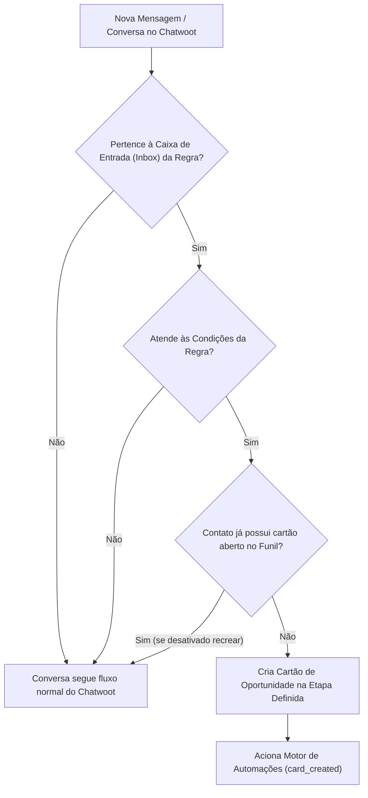

# 📥 Guia de Regras de Entrada: Casos de Uso & Criação Automática de Leads

> **Módulo:** `chatwoot-kanban`  
> **Autor & Engenharia:** Gihovani Demetrio (GG2) — [gihovani@gg2.com.br](mailto:gihovani@gg2.com.br)  
> **Compatibilidade:** Chatwoot v4.18.x (CE & Forks)

---

## 📖 Visão Geral

As **Regras de Entrada (Entry Rules)** do `chatwoot-kanban` automatizam o momento exato em que uma conversa do Chatwoot (WhatsApp, Instagram Direct, Facebook Messenger, Chat Web, etc.) é convertida em um **cartão de oportunidade dentro do funil de vendas**.

Em vez de exigir que os atendentes criem manualmente cada oportunidade durante o atendimento, as Regras de Entrada filtram conversas em tempo real por caixa de entrada, etiquetas, equipe ou tipo de conversa e alocam o lead diretamente na etapa correta.

---

## 🛡️ Conceitos Fundamentais

### 1. Escopo por Caixa de Entrada (`inboxes` ou `all_inboxes`)
Cada regra pode atuar em caixas específicas (ex: apenas o *WhatsApp Comercial*, ignorando o *WhatsApp Financeiro/Suporte*) ou em todas as caixas de entrada da conta.

### 2. Etapa de Destino (`kanban_stage_id`)
Você pode definir explicitamente para qual estágio regular o cartão será enviado (ex: *Lead / Primeiro Contato* ou *Triagem Comercial*).  
> ⚠️ **Proteção de Integridade:** O sistema impede que regras de entrada apontem para estágios terminais (*Ganho* ou *Perdido*).

### 3. Filtro de Grupos vs. Conversas Individuais (`conversation_type`)
No WhatsApp é muito comum ter grupos de suporte ou condomínios. O motor detecta o identificador padrão do WhatsApp (`@g.us`) e permite ignorar grupos automaticamente ou direcioná-los para funis específicos.

---

## 🎯 Catálogo de Casos de Uso Práticos

---

### 📌 Caso de Uso #1: Captura Automática de Novos Leads via WhatsApp Comercial
* **Cenário / Problema:** Vendedores perdem tempo cadastrando oportunidades manualmente e muitos clientes que chamam no WhatsApp acabam esquecidos sem card no funil.
* **Módulo:** Regras de Entrada (`KanbanBoardEntryRule`).
* **Caixa de Entrada:** `WhatsApp - Vendas` (`inbox_id: 1`).
* **Condições Aplicadas:**
  * `conversation_type` = `individual` (Garante que mensagens de grupos não criem cartões de venda).
* **Etapa de Destino:** `Lead / Primeiro Contato` (`stage_id: 1`).
* **Passo a Passo na Interface:**
  1. No menu lateral, acesse **Kanban** ➔ Clique no Funil Comercial ➔ **Configurações** (ícone de engrenagem).
  2. Clique na aba **"Regras de Entrada"** ➔ **Nova Regra**.
  3. Dê o nome: *"Captura de Leads WhatsApp"*.
  4. Selecione a Caixa: `WhatsApp - Vendas`.
  5. Em condições, adicione `Tipo de conversa` `igual a` `Individual`.
  6. Escolha a etapa de destino: `Lead / Primeiro Contato`.
  7. Salve a regra.
* **Resultado:** Todo novo cliente que mandar um *"Olá"* no WhatsApp terá imediatamente uma oportunidade criada no funil, pronta para atendimento.

---

### 📌 Caso de Uso #2: Roteamento de Leads Qualificados por Palavra-Chave / Etiqueta
* **Cenário / Problema:** O chatbot inicial do Chatwoot qualifica o cliente e aplica a etiqueta `interessado-solar` ou `pedido-orcamento`. Apenas os clientes com essas etiquetas devem entrar no funil de negociação.
* **Módulo:** Regras de Entrada.
* **Caixas de Entrada:** Todas as Caixas (`all_inboxes: true`).
* **Condições Aplicadas:**
  * `labels` `includes_any` `["interessado-solar", "pedido-orcamento"]`
  * `conversation_type` = `individual`
* **Etapa de Destino:** `Em Negociação / Proposta` (`stage_id: 2`).
* **Passo a Passo na Interface:**
  1. Na aba **Regras de Entrada**, crie a regra *"Leads Qualificados pelo Bot"*.
  2. Marque *"Todas as caixas de entrada"*.
  3. Adicione a condição `Etiquetas` `contém qualquer uma de` e selecione `interessado-solar` e `pedido-orcamento`.
  4. Defina a etapa de destino como `Em Negociação / Proposta`.
  5. Salve.
* **Resultado:** Clientes que entram apenas para dúvidas de suporte não poluem o funil comercial. O cartão só nasce quando o bot aplica a etiqueta de interesse.

---

### 📌 Caso de Uso #3: Entrada Direcionada por Time ou Atendente Específico
* **Cenário / Problema:** Uma equipe de corretores/vendedores específicos (ex: Equipe *"Vendas Enterprise"*) atende contas estratégicas. As conversas atribuídas a esse time devem entrar diretamente em um funil dedicado de grandes contas.
* **Módulo:** Regras de Entrada.
* **Condições Aplicadas:**
  * `team_id` `is_one_of` `[3]` (*Time Enterprise*)
* **Etapa de Destino:** `Diagnóstico Avançado` (Funil Enterprise).
* **Resultado:** Garantia de segregação de leads: atendentes comuns não visualizam oportunidades corporativas sensíveis.

---

### 📌 Caso de Uso #4: Bloqueio de Conversas Não Atribuídas (Triagem Prévia)
* **Cenário / Problema:** A empresa prefere que o card no funil só seja gerado depois que um humano aceitar e assumir a conversa na fila do Chatwoot.
* **Condições Aplicadas:**
  * `assignee_id` `is_not_one_of` `["none"]` (Atendente não é nulo/vazio).
* **Resultado:** Enquanto a conversa estiver na aba *"Não atribuídos"* do Chatwoot, nenhum cartão é gerado. No instante em que o vendedor assume o chat, o card é criado no nome dele.

---

## 🔍 Tabela Completa de Parâmetros de Condição

| Atributo (`attribute_key`) | Operadores Disponíveis | Valores Suportados | Exemplo Prático |
|---|---|---|---|
| `labels` | `includes_any`, `includes_all`, `not_includes` | Array de etiquetas do Chatwoot | Somente conversas com tag `lead-quente` |
| `conversation_type` | `is_one_of`, `is_not_one_of` | `individual`, `group` | Ignorar grupos de WhatsApp (`individual`) |
| `assignee_id` | `is_one_of`, `is_not_one_of` | IDs dos usuários ou `"none"` | Apenas conversas já atribuídas a alguém |
| `team_id` | `is_one_of`, `is_not_one_of` | IDs das equipes do Chatwoot | Apenas conversas do *Time Comercial* |
| `priority` | `is_one_of`, `is_not_one_of` | `low`, `medium`, `high`, `urgent` | Conversas marcadas como prioridade alta |

---

## 💬 Contato & Comunidade

Dúvidas, sugestões ou interesse em contribuir com o projeto:
* 💼 **LinkedIn:** [linkedin.com/in/gihovani](https://www.linkedin.com/in/gihovani/)
* ✉️ **E-mail:** [gihovani@gg2.com.br](mailto:gihovani@gg2.com.br)
