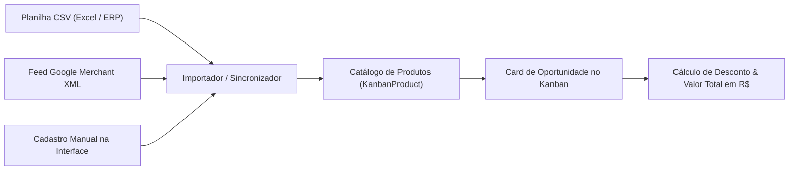

# 🛍️ Guia de Catálogo de Produtos & Feeds: Casos de Uso & Gestão Comercial

> **Módulo:** `chatwoot-kanban`  
> **Autor & Engenharia:** Gihovani Demetrio (GG2) — [gihovani@gg2.com.br](mailto:gihovani@gg2.com.br)  
> **Compatibilidade:** Chatwoot v4.18.x (CE & Forks)

---

## 📖 Visão Geral

O módulo **Catálogo de Produtos** do `chatwoot-kanban` integra um inventário comercial nativo diretamente ao Chatwoot. 

Ele permite que os atendentes busquem produtos, adicionem itens com desconto à oportunidade e calculem o valor total da negociação em tempo real — sem precisar abrir abas de e-commerce, ERP ou planilhas externas durante a conversa com o cliente.



---

## 🛡️ Principais Capacidades

### 1. Promoções Dinâmicas "De / Por"
Cada produto suporta `price` (preço regular) e `sale_price` (preço promocional).
* Quando `sale_price` está ativo, o card do produto exibe badge visual de **"PROMOÇÃO"**, risca o preço antigo e calcula a economia para o cliente.

### 2. Importador CSV Inteligente & Tolerante
* **Autodetecção de Separadores:** Reconhece ponto e vírgula (`;`), vírgula (`,`) ou tabulação (`\t`).
* **Tratamento de Moedas Brasileiras:** Interpreta automaticamente `R$ 1.490,90`, `1490.90 BRL` ou `$ 99.00`.
* **Remoção de BOM do Excel:** Elimina o cabeçalho oculto `\xEF\xBB\xBF` exportado pelo Microsoft Excel que costuma quebrar importadores tradicionais.

### 3. Integração com Feed Google Merchant XML
* Sincronização automatizada periódica (ex: a cada 24 horas via background job `KanbanProductSyncJob`).
* Ideal para e-commerces que já possuem catálogo atualizado em Shopify, WooCommerce, Nuvemshop, Tray ou VTEX.

---

## 🎯 Catálogo de Casos de Uso Práticos

---

### 📌 Caso de Uso #1: Cotação e Adição de Itens Durante Atendimento no WhatsApp
* **Cenário / Problema:** O cliente pergunta o preço de 2 itens pelo WhatsApp. O atendente precisa consultar o catálogo e calcular o valor final da proposta.
* **Módulo Utilizado:** Painel de Oportunidades do Kanban / Modal de Produtos (`KanbanOpportunityPicker.vue`).
* **Passo a Passo na Interface:**
  1. No chat da conversa no Chatwoot, abra a barra lateral do **Kanban**.
  2. No cartão da oportunidade, clique na aba **"Produtos & Cotação"**.
  3. Digite o nome ou SKU do item na barra de busca (ex: *"Placa Solar 550W"* ou *"Bateria 100Ah"*).
  4. Clique em **"Adicionar ao Carrinho"** e ajuste a quantidade.
  5. Se desejar, aplique um desconto comercial (percentual ou valor fixo em R$).
* **Resultado:** O valor da oportunidade (`total_value`) é atualizado instantaneamente no Kanban, alimentando métricas de previsão de faturamento e relatórios.

---

### 📌 Caso de Uso #2: Carga Inicial de Catálogo via Planilha CSV do ERP
* **Cenário / Problema:** A empresa possui 500 produtos cadastrados no ERP (Bling, Tiny, Omie) e precisa disponibilizá-los imediatamente no Chatwoot.
* **Módulo Utilizado:** Fontes de Produto (`KanbanProductSource` ➔ `csv_upload`).
* **Formato Aceito da Planilha CSV:**
```csv
sku;title;price;sale_price;category;brand
SOL-01;Painel Solar Fotovoltaico 550W;890.00;799.90;Paineis;Canadian
INV-02;Inversor Monofasico 5kW;4200.00;3990.00;Inversores;Growatt
CAB-03;Cabo Solar 6mm Preto (metro);6.50;;Cabos;Prysmian
```
* **Passo a Passo na Interface:**
  1. Acesse o Funil ➔ **Configurações** ➔ **Produtos** ➔ **Importar CSV**.
  2. Arraste o arquivo `.csv`.
  3. O sistema processa os itens, atualiza produtos existentes pelo `sku` e insere os novos em segundos.
* **Resultado:** 500 produtos disponíveis para todos os vendedores instantaneamente.

---

### 📌 Caso de Uso #3: Sincronização Automática com Feed Google Shopping do E-commerce
* **Cenário / Problema:** Os preços e estoques da loja virtual mudam diariamente e a equipe comercial não pode vender com preços desatualizados.
* **Módulo Utilizado:** Fontes de Produto (`source_type: 'google_merchant_xml'`).
* **Configuração:**
  * URL do Feed XML: `https://minhaloja.com.br/feed/google-shopping.xml`
  * Intervalo de Sincronização: `24` horas.
* **Passo a Passo na Interface:**
  1. Nas configurações de produtos do Kanban, selecione **"Nova Fonte de Dados"**.
  2. Tipo: **Feed XML (Google Merchant)**.
  3. Cole o link público do feed XML da sua loja virtual.
  4. Clique em **"Sincronizar Agora"**.
* **Resultado:** O Chatwoot sincroniza títulos, fotos dos produtos, preços vigentes e links originais sem intervenção manual.

---

## 🔍 Tabela de Atributos do Produto

| Campo | Tipo | Descrição | Exemplo |
|---|---|---|---|
| `sku` | String (Único) | Código identificador único do produto | `PRD-10293` |
| `title` | String | Nome comercial do produto | *Bateria de Lítio 48V 100Ah* |
| `price` | Decimal | Preço base / regular | `R$ 7.900,00` |
| `sale_price` | Decimal (Opcional) | Preço promocional "De / Por" | `R$ 6.990,00` |
| `category` | String | Categoria do item | *Armazenamento de Energia* |
| `brand` | String | Fabricante ou marca | *BYD* |
| `image_url` | URL | Link direto da imagem do produto | `https://cdn.loja.com/img.jpg` |
| `availability`| Enum | Disponibilidade em estoque | `in_stock` ou `out_of_stock` |

---

## 💬 Contato & Comunidade

Dúvidas, sugestões ou interesse em contribuir com o projeto:
* 💼 **LinkedIn:** [linkedin.com/in/gihovani](https://www.linkedin.com/in/gihovani/)
* ✉️ **E-mail:** [gihovani@gg2.com.br](mailto:gihovani@gg2.com.br)
