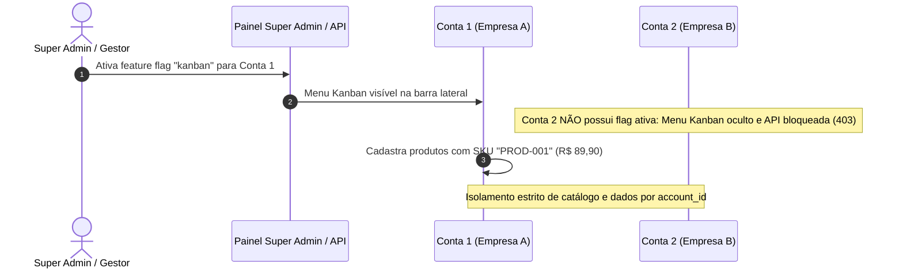
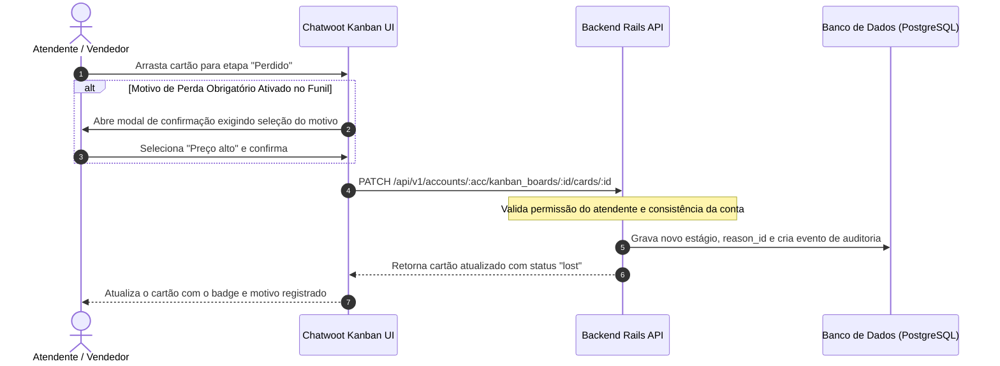
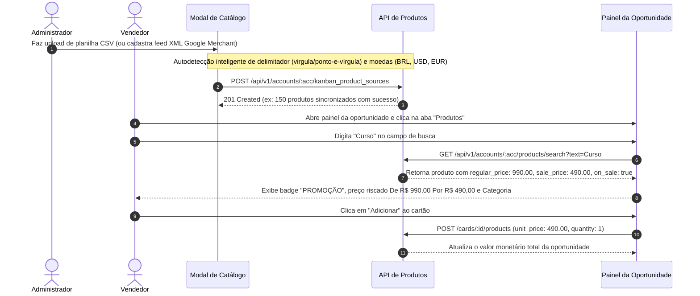

# Guia do Usuário e Administrador: Chatwoot Kanban

Este guia orienta a utilização e administração completa do módulo **Kanban CRM** integrado ao Chatwoot, abordando a arquitetura multi-tenant por conta, operação de cartões e oportunidades, configuração de funis, gestão de motivos de ganho/perda e o catálogo de produtos com suporte a promoções De / Por.

---

## 1. Arquitetura Multi-tenant & Feature Flags por Conta

O módulo Kanban é **100% isolado por conta (multi-tenant)**. Uma instalação do Chatwoot com centenas de contas permite habilitar o Kanban apenas para as contas contratantes, mantendo os dados de funis, clientes, oportunidades e produtos totalmente estanques.

### A. Como Habilitar o Kanban em uma Conta
O controle de acesso é gerenciado através de feature flags nativas do Chatwoot (`feature_flags_ext_1`):

- **`kanban`**: Habilita a exibição do menu lateral e as rotas `/app/accounts/{id}/kanban`. Se desativada para a conta, qualquer tentativa de acesso via API ou interface retorna bloqueio de autorização (`403 Forbidden`).
- **`kanban_products`**: Habilita a sincronização de feeds e a busca de produtos na conta.

#### Ativação pelo Super Admin ou Rails Console:
```ruby
account = Account.find(1) # ID da conta
account.enable_features!('kanban', 'kanban_products')
```
Ou diretamente pelo painel de Super Admin (`/super_admin/accounts/{id}`).

### B. Isolamento de Dados por Conta
- **Funis e Cartões:** Cada funil pertence a uma conta específica (`account_id`). Agentes de uma conta jamais visualizam ou movem leads de outra conta.
- **Catálogo de Produtos:** As fontes de catálogo (`KanbanProductSource`) e os itens (`KanbanProduct`) possuem índice composto único `[:account_id, :sku]`. O SKU `PROD-001` da Conta 1 pode ter preço e estoque totalmente diferentes do `PROD-001` da Conta 2.



---

## 2. Onde Cadastrar os Motivos de Ganho e de Perda

Os motivos de encerramento são gerenciados **por funil (board)**, permitindo que cada área da empresa (ex: Vendas B2B, Suporte, Parcerias) defina seus próprios critérios de fechamento e perda.

### Passo a passo para cadastrar:
1. No menu lateral, acesse **Kanban** (`/app/accounts/{id}/kanban`).
2. Localize o funil desejado e clique no ícone de **Configurações (Engrenagem)** do funil.
3. No painel de configuração, clique na aba **"Motivos"** (`reasons`).
4. A tela apresenta duas colunas organizadas:
   - **Motivos de Perda** (ex: *Preço alto*, *Sem orçamento*, *Escolheu concorrente*, *Desistência*).
   - **Motivos de Ganho** (ex: *Fechamento padrão*, *Indicação de parceiro*, *Upgrade de plano*).
5. Clique em **"Adicionar Motivo"**, preencha o **Título**, uma descrição opcional e selecione o tipo (**Ganho** ou **Perda**).
6. Salve. O motivo estará disponível imediatamente para todos os atendentes do funil.

> [!TIP]
> Na aba **"Configurações"** do mesmo funil, ative a opção **"Motivo de Perda Obrigatório"**. Isso força o atendente a selecionar um motivo sempre que mover um cartão para o estágio de *Perdido*, garantindo dados para relatórios de conversão.

---

## 3. Fluxos Operacionais com Diagramas de Sequência

### Diagrama 1: Movimentação de Estágio e Fechamento com Motivo Obrigatório



---

### Diagrama 2: Catálogo de Produtos, Promoção De / Por e Cotação no Cartão



---

## 4. Recursos Avançados por Funil

### A. Toggles de Exibição (Funis Comerciais vs. Não Comerciais)
Nas configurações de cada funil (aba **Configurações**):
- **Habilitar Produtos na Oportunidade (`enable_products`)**:
  - *Ativado:* Exibe a aba "Produtos" no modal de oportunidade para cotações.
  - *Desativado:* Remove a aba de produtos (ideal para funis de Help Desk, Onboarding ou Jurídico).
- **Exibir Valores Monetários (`show_monetary_values`)**:
  - *Ativado:* Exibe os valores em R$ nos cartões, no topo das etapas e no cabeçalho de resumo do funil.
  - *Desativado:* Oculta os totalizadores em moeda (evita a poluição visual de "R$ 0,00" em funis de suporte e atendimento).

### B. Importação Inteligente de Planilhas CSV
O sistema possui tratamento robusto para arquivos exportados de diferentes plataformas:
- **Autodetecção de Delimitador:** Aceita automaticamente ponto e vírgula (`;` - padrão Excel PT-BR), vírgula (`,` - padrão Google Sheets/US) ou tabulação (`\t`).
- **Remoção de UTF-8 BOM:** Não corrompe a primeira coluna se o arquivo for gerado pelo Excel no Windows.
- **Detecção de Moedas e De / Por:** Aceita números puros (`49.90`) ou com sufixo/prefixo de moeda (`49.90 BRL`, `R$ 49,90`, `$ 49.99`).
- **Download de Modelo CSV:** Diretamente no modal de importação há um botão para baixar o modelo com cabeçalhos e exemplos prontos.
## 5. Como Criar Cada uma das Automações (Guia Passo a Passo)

As automações no Kanban operam no modelo **Evento -> Condições (Filtros) -> Ações**.

### Passo a passo para criar qualquer regra na interface:
1. Acesse o Funil e clique no ícone de **Configurações (Engrenagem)** (`/kanban/:id/edit`).
2. Clique na aba **"Automações"** (`automations`).
3. Clique no botão **"Adicionar regra"**.
4. Configure os 4 blocos da regra:
   - **Nome e Descrição:** Identificação amigável da regra.
   - **Gatilho (Evento):** Quando a automação deve ser disparada.
   - **Condições (Opcional):** Filtros refinados (ex: *Estágio atual*, *Etiquetas*, *Prioridade*, *Valor da oportunidade*, *Tempo no estágio*).
   - **Ações:** O que o sistema deve fazer quando o evento ocorrer e as condições forem verdadeiras.
5. *(Recomendado)* Deixe a opção **Modo de Simulação (Dry Run)** marcada para testar primeiro nos logs sem alterar dados.
6. Salve a regra.

> 📖 **Para uma documentação aprofundada com 9 Casos de Uso Reais, variáveis dinâmicas e matriz completa de gatilhos e ações, consulte o manual dedicado: [docs/AUTOMATIONS.md](AUTOMATIONS.md).**

---

### Catálogo de Ações Disponíveis com Exemplos Práticos Validados

Abaixo estão os 7 tipos principais de automação suportados, com seus parâmetros e exemplos testados com 100% de sucesso no ambiente:

| # | Tipo de Automação / Ação | Gatilho Típico | Parâmetros de Configuração | Exemplo Prático de Uso |
|---|---|---|---|---|
| **1** | **Mover de Estágio** (`move_to_stage`) | `card_created` ou `due_soon` | `stage_id: <ID_DO_ESTÁGIO>` | Mover lead recém-criado diretamente para a etapa *"Em Negociação"*. |
| **2** | **Definir Prioridade** (`set_priority`) | `card_created` ou `stage_changed` | `priority: 'urgent'` (`low`, `medium`, `high`, `urgent`) | Se a oportunidade tiver valor > R$ 5.000, marcar automaticamente com prioridade **Urgente**. |
| **3** | **Adicionar Etiquetas** (`add_label`) | `card_created` ou `no_reply` | `labels: ['lead-vip', 'prioridade']` | Aplicar a etiqueta **lead-vip** para segmentação rápida e relatórios. |
| **4** | **Remover Etiquetas** (`remove_label`) | `stage_changed` | `labels: ['pendente-contato']` | Remover etiquetas temporárias assim que o atendente avançar o cartão. |
| **5** | **Definir Vencimento** (`set_due_at`) | `card_created` ou `stage_changed` | `days: 3`, `business_days: true` | Agendar data de vencimento da oportunidade para **3 dias úteis** à frente. |
| **6** | **Criar Nota Interna** (`create_note`) | `stage_changed` ou `card_stalled` | `content: "Texto da nota"` | Registrar nota de auditoria interna: *"Lead estagnado há mais de 48 horas. Contatar urgente."* |
| **7** | **Atribuir Responsável** (`assign_agents`) | `card_created` | `agent_ids: [1]`, `mode: 'set'` ou `'add'` | Distribuir novos leads automaticamente para o atendente responsável pela carteira. |
| **8** | **Desqualificar / Perdido** (`mark_as_lost`) | `card_stalled` ou `no_reply` | `reason_id: <ID_DO_MOTIVO_DE_PERDA>` | Encerrar oportunidades sem resposta há 15 dias marcando como **Perdido** com o motivo *"Sem contato"*. |

---

## 6. Como Auditar a Execução das Automações

O módulo Kanban possui um subsistema próprio de **auditoria e logs de execução em tempo real** (`KanbanAutomationLog`) que registra cada disparo de regra.

### A. Onde Visualizar os Logs na Interface
1. No painel de configuração do Funil (`/kanban/:id/edit`), acesse a aba **"Automações"**.
2. Clique na sub-aba **"Logs de Execução"** (`log`).
3. A tabela exibe todo o histórico de execuções com filtros por:
   - **Regra específica** ou todas as regras.
   - **Status da execução:**
     - `executed`: Regra executada com sucesso e ações aplicadas no cartão.
     - `simulated`: Modo de simulação (*Dry Run*) ativado para testes sem alterar dados.
     - `skipped`: Disparo bloqueado pelos **Guardrails** de segurança (ex: fora do horário comercial, limite de mensagens automáticas por contato por dia).
     - `failed`: Erro na execução (com mensagem de diagnóstico detalhada).

### B. Resultado da Suíte de Testes Executada no Ambiente
Validamos todas as ações do motor de automação diretamente no banco de dados e nos workers de background:
- `move_to_stage`:  Estágio atualizado com sucesso.
- `set_priority`:  Prioridade `urgent` gravada no cartão.
- `add_label`:  Etiquetas `lead-vip` adicionadas.
- `set_due_at`:  Vencimento calculado respeitando dias úteis.
- `create_note`:  Nota interna criada no histórico do cartão.
- `assign_agents`:  Atendente associado ao cartão com sucesso.
- `mark_as_lost`:  Cartão movido para a etapa de Perdido com motivo gravado.


